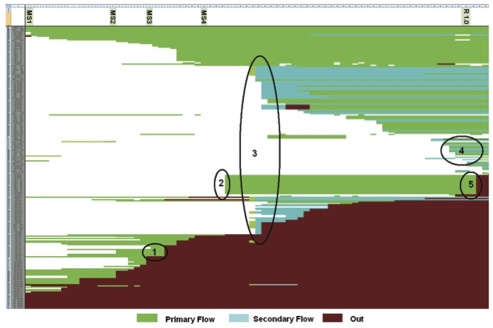
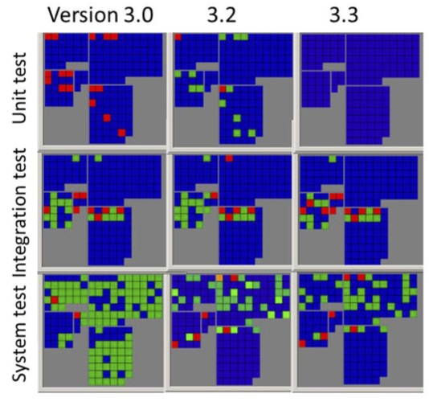

#Mere numbers aren't enough: a plea for visualization
Per Runeson, Lund University, Sweden

##Numbers are good, but…
Quantitative data come with enormous possibilities to present key characteristics of the data in very compressed form. Basic descriptive statistics, like mean and standard deviation, comprise thousands or millions of data points into single numbers. This is a very powerful tool when communicating quantitative data analyses.  In contrast, qualitative data with its focus on descriptions, words and phrases do not come with such powerful tools, leading to wordy descriptions of the analysis. However, mean and standard deviation do not bring the full understanding of the underlying phenomenon, and not even the underlying distribution. 

In data science for software engineering, we cannot trust numbers only, but need additional tools to analyze the data and communicate the findings and conclusions of the analysis. Visualization, or visual analytics, provides such a tool that utilizes the exactness and compactness of quantitative data, with the richness and communication of qualitative communication. Thereby, both the analysis and interpretation of data can be improved.

##Case Studies on visualization
As examples of the use of visualization in data science for software engineering, we show two case studies on product scoping (Wnuk et al 2009) and test selection (Engström et al 2014), respectively.

**Product scoping.** Selecting which features to spend development resources on is a key task for product managers, referred to as product scoping. The product manager must decide which features to invest development effort on and which to exclude from the current project. In order to analyze how well a company was able to identify the feasible set of features at an early stage for later development and release, researchers collected data on which features were selected for development. Further, they analyzed which features made it into the final release, and which were excluded out during later stages of development, for example, due to changing market situation or competing products. Excluding features late implies development effort is wasted.

The researchers defined several relevant metrics. Basic ones include the average share of excluded features, and the time to birth and time to removal of a feature. However, the overall view was hard to communicate until they presented the feature survival chart, visualizing features and their status change in an x-y-diagram, see Figure 1. The features are listed on the y axis – one row for each feature - and time and milestones are marked on the x axis. Feature status is color coded: red for excluded features, and two shades of green for inserted features, depending on the source of the feature request.

Through the visualization chart, managers got an overview of the scoping of features and were able to connect major decisions in the project to the scope, marked with numbers in Figure 1, and further explained by Wnuk et al (2009). For example, number 1 in Figure 1 represents a significant scope reduction, related to a cancellation of the products from the product line. At number 3, new featreus were included while anothers were excluded in parallel. This was the desired behavior at the company, since the development resources were limited. On the contrary, at number 4, new features were included late in the proejct, which is related to significant risks.  This analysis helped them rethink the scoping process to make it more efficient. 

Figure 1. Product scoping chart, from Wnuk et al (2009).

**Regression test selection.** Selecting test cases for regression testing of a new software version is the second case study on visualization. In a product-line project, there are several dimensions that are relevant to analyze to support the choice of regression tests, for example (1) levels of abstraction (unit, integration, system etc.), (2) regression testing as the system evolves over time with new versions, and (3) testing over different product variants, sharing a common code base (Runeson and Engström, 2012). We collected data on number of test cases, test case execution, failed tests, etc. However, for test designers and managers, none of these metrics were sufficient to support their regression test selection. The many dimensions made it hard to understand which test cases were run at which level, version and variant.

We prototyped a visualization tool that enables the users to view multiple views of the data, and to combine several dimensions, see Figure 2 for an example of a subset of an industrial software system (Engström et al, 2014). Each dot represents one test coverage item, and the color coding signals the frequency of the metric under analysis, e.g. the number of executed test cases. In this case, red means insufficient number of test cases for the item under test, green sufficient number of test cases and blue the range in between. The example shows that version 3.0 was well tested in system test, but insufficiently in unit test. More unit testing and less system testing was conducted in versions 3.2 and 3.3, while integration testing remains the same across releases.

We evaluated the tool in three industrial focus groups with experienced test managers and consultants.  The users were generally in favor of the visualization prototype, while they provided detailed feedback on which data to visualize, and how. They wanted the x-y position to be used to carry a meaning, and requested more dynamic interaction in the views, than our prototype could manage.

 

Figure 2. Test coverage item overviews for test levels and software versions, from Engström et al (2014).

These case studies clearly show the power of visualization. Graphs may help stakeholders get an overview of data, which is tailored to support their decisions. In the feature scoping case, some managers interpreted all descoped features as waste, which might not be the case. The organization may have learned something during the work with the feature, although the visualization clearly signals it as waste. This message has to be brought together with the visualization, so the graphs are not over-interpreted. 

##What to do
Based on the experience from our case studies, we conclude that visualizations help analysis and interpretation of software engineering data. Thus we recommend practitioners to:

1.	*Create visualizations from data.* Visual representation of data helps interpreting and communicating the collected data in software engineering data science. There is no standard visualization model that fits every purpose, but it has to be adapted to the type of data, the audience and the purpose of the visualization.
2.	*Allow interactions in the graphs.* Once the visualizations are produced, the users start realizing the opportunities to interact with the graphs. In our cases, users asked for the ability to change views and select data subsets dynamically, in order to understand the situation. Thus, visualization should be considered dynamic, not a static view of collected data.
3.	*Beware of the power of visualization.* Visualizations may give a stronger impression than is actually supported by the data. Thus, the visualization has to be followed up with the users to understand how they interpret it, and possibly adjusted accordingly. 

These recommendations align with Schneidermann’s classical visualization mantra: *Overview first, zoom and filter, then details-on-demand* (Shneiderman, 1996).

##References
Emelie Engström, Mika Mäntylä, Per Runeson, Markus Borg:
Supporting Regression Test Scoping with Visual Analytics. Proceedings of the international conference on Software Testing, Verification and Validation, pp. 283-292, 2014.

Ben Shneiderman, "The eyes have it: a task by data type taxonomy for information visualizations, Proceedings IEEE Symposium on Visual Languages, pp. 336- 343, 1996.

Krzysztof Wnuk, Björn Regnell, Lena Karlsson, What Happened to Our Features? Visualization and Understanding of Scope Change Dynamics in a Large-Scale Industrial Setting, Proceedings of the 17th IEEE International Requirements Engineering Conference, pp. 89-98, 2009.

Per Runeson, Emelie Engström, Software product line testing – a 3D regression testing problem, Proceedings of 2nd International Workshop on Regression Testing, 2012.

