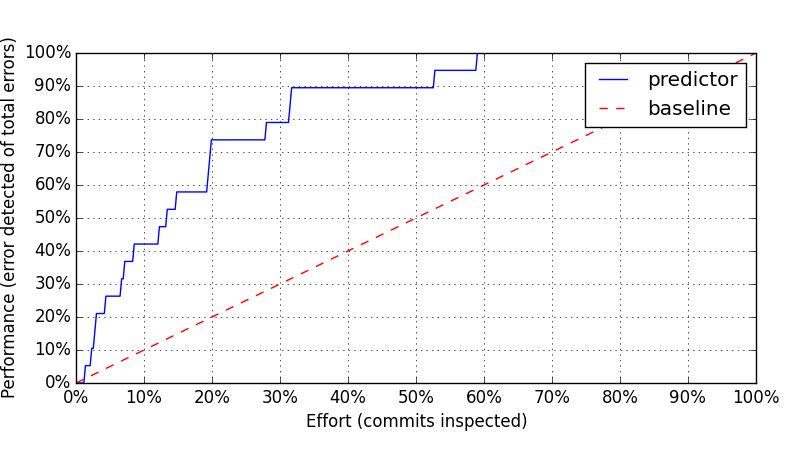
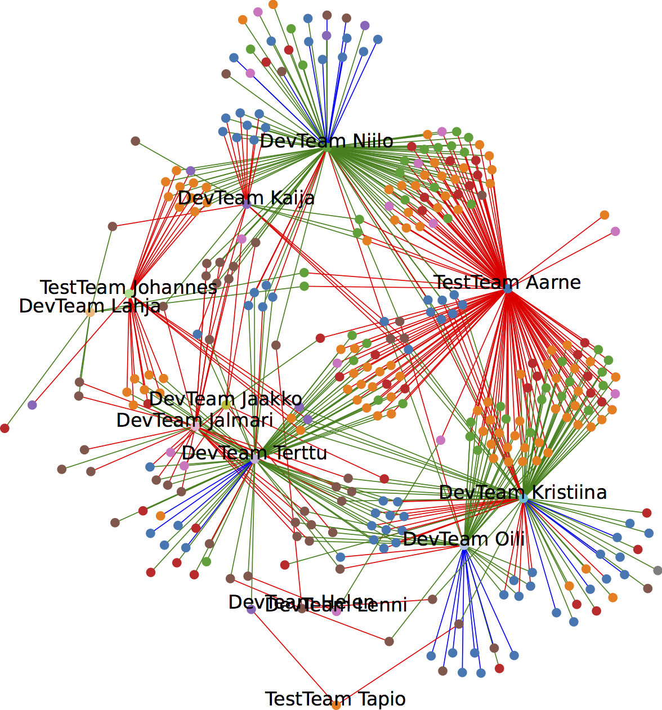

#Finding the Relevant Problems to Analyze is the Key to Provide Insight to Practitioners
*Burak Turhan, University of Oulu, Finland*

*Kari Kuutti, University of Oulu, Finland*

##Introduction

In this chapter we share our experiences in conducting a software analytics project on bug prediction. Though the project was a success in terms of _scholarly_ outcomes and performance measures, we had run into difficulties in communicating the results to the practitioners. It turned out that our predictions on the likelihood of edited files to contain bugs were perceived as stating the obvious – even through many different modes of communication/ representation; the most useful and insightful representation turned out to be a visualization of the existing issue reports that involved no predictions at all. The solution emerged when we changed our question from "where will bugs occur?" to "how are existing bugs processed?". In other words, a simpler analysis to answer a simpler question provided more actionable insights to the engineers than the more complex alternative.

##Context of the Software Analytics Project
The idea of bug prediction is to prioritize the test efforts to the parts of the system that are most probable to cause potential failures. This is expected to result in more cost effective testing, especially when the resources needed for testing the project are relatively expensive [1]. With this goal in mind, we started an analytics case project with an industrial parter. The data for the analysis presented here come from the software component of a mission-critical embedded system project implemented in C++ language with over 100,000 lines of code. The development activities were carried out in two distinct geographical locations by multiple development and testing teams, adding up to about 60 developers in total. Data collected from the issue management tool reflects the development history of the project spanning a period of two-years. One development team volunteered to pilot the developed software analytics models and modes of information representation, providing feedback through personal communication with the R&D team during project meetings [1].

##Providing Predictions on Buggy Changes

The predictor model was selected among a multitude of machine learning algorithms [1]. Once the final predictor was created and its accuracy was fine-tuned, the results were presented to a team of practitioners. The graph above basically says that 90% of all bugs can be detected by going through the top 30% of the predictions, which most scholars would think is a great result! However, the feedback from the practitioners was that the prediction performance graphs and measures were not that useful for them. They indicated that such performance figures do not provide insight to have an impact in their daily work, and pointing out error-prone sections within files was regarded as stating the obvious.

Hence, we started working on finding different ways to help the development teams utilizing the results in practice. Consequently, we developed multiple ways of communicating our analysis to practitioners. After several attempts with no acceptance [1] we have come up with an _error-handling graph_, which visualize the interactions among teams based on the errors introduced and fixed. To our surprise, this turned out to be the most helpful representation as it helped pinpointing communication related issues within and across software development teams.

##How to Read the Graph?

An error-handling graph, example provided above, shows the _latent_ interactions (i.e. there but not visible unless you specifically extract them) among software development teams in terms of errors that are reported and fixed. The errors are linked to the teams that have reported or fixed the error. There are two types of nodes in the error-handling graph. The nodes with text labels correspond to the teams involved in the project. Text labels start either with the prefix DevTeam or TestTeam, meaning that the corresponding team is a development or testing team, respectively. The nodes between the text labeled nodes represents bugs extracted from the issue management tool, and they are color coded by the level of testing at which they are detected. A green edge from a team node to an error node means that the corresponding team has fixed the reported error. On the other hand, a red edge means that the corresponding team has reported that error. Finally, blue lines represent the errors that are reported and fixed by the same team [1].

##(Anti-)Patterns in the Error-handling Graph

In an ideal scenario, one would expect to see patterns in an error-handling graph, where all errors are either reported by a testing team and fixed by the responsible development team, or reported and fixed by the same development team. Moreover, an ideal scenario would assume that there would be no issues originating from the interactions among the teams, i.e. an anti-pattern. Such errors are likely to have been missed in team level testing, propagated to higher levels causing re-work, and should have been detected earlier within the team.

Analysis of the example figure in terms of (anti-) patterns reveals the following insights:

- Pattern (a): It can be seen that the testing team named ‘Aarne’ is reporting most of the errors, e.g. the density of the red edges are very high around that team’s node.

- Pattern (b): Development teams named ‘Oili’ and ‘Niilo’ are following the good practice of transparency by sharing the errors discovered and fixed within the team with the rest of the project teams.

- Anti-pattern: There exists a cluster of errors between the development teams ‘Terttu’ and ‘Kristiina’. This indicates that the development works of the teams are most likely to be dependent on each other and errors propagate out of either team’s internal quality assurance process, impacting the work of the other.

## How to _Act_ on (Anti-)Patterns?

Based on the initial findings listed above, the following actionable insights can be taken into account:

- Depending on the amount of errors detected by the testing teams in each testing level, an analysis on the nature of errors can be conducted to understand which level of testing needs to be improved (checking color codes in the graph) in order to identify the errors earlier in the process.
- All development teams can be encouraged to report the errors found within their internal processes in the global issue repository in order to improve the transparency of the development process. This would enable the collaborating teams to share insights about the problems encountered in the shared part of the code.
- Internal quality processes of the teams can be improved, especially when errors are propagating across development teams. This would save time and effort spent on re-work activities. In addition, the communication and coordination practices between such teams can be improved in order to reduce the number of errors reported across teams.

To elaborate more on the last item: there are two potential reasons for the conflict between ‘Terttu’ and ‘Kristiina’ teams. One reason could be that the teams’ way of working may be lacking quality gates for checking how their changes affect the work of others. Alternatively, there are latent dependencies between the parts the teams are concurrently working on. Such dependencies may have not been noticed and flagged when the division of labor between the teams is planned. So, the error-handling graph can in principle indicate problems in two levels: programming and testing practices/tools inside the teams, and in planning and dependency identification practices/tools. Further, the nature of those latent dependencies may not necessarily be code-based. In other words, code-based dependencies may just be a symptom of dependencies not detected at higher levels of abstraction, e.g. conflicting requirements from different stakeholders that are missed, or changes in requirements that were not communicated to the both teams properly. In any case, the root cause is a communication/ coordination related issue that can be further worked on, yet can easily be identified by a visual inspection of the error-handling graph.

##Summary
 The goal of software analytics is to propose actionable changes to the way the projects are run [2]. Practitioners need to be convinced about the benefits before even consdering taking actions. Our experience revealed that asking the right questions that are deemed relevant by practitioners is a key factor to provide useful insights for them. As in our case, this might require simplifying complex questions and analyses to simpler ones that are more relevant to practitioners.

 _Summary goes here_

##References
1.	Taipale, T., Turhan, B. and Qvist, M. Constructing Defect Predictors and Communicating the Outcomes to Practitioners. In Proceedings of the 7th International Symposium on Empirical Software Engineering and Measurement (ESEM 2013 Industry Track), 2013.
2.	Menzies, T. and Zimmermann, T. Software Analytics: So What? IEEE Software, vol. 30/4, pp. 31-37, 2013.
