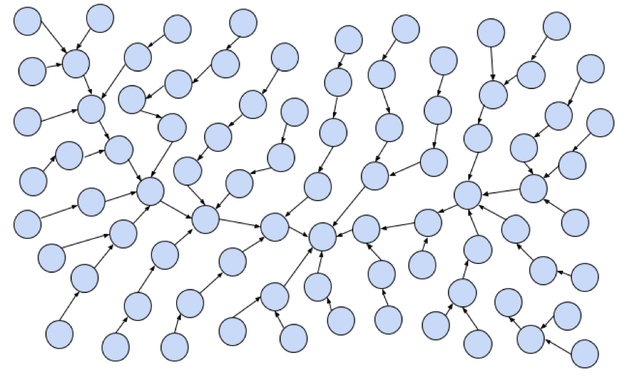
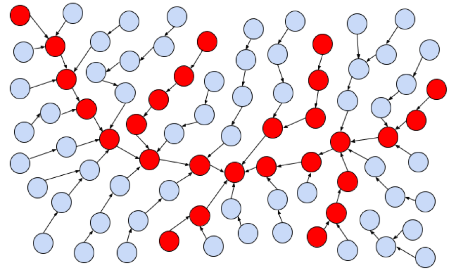

# Stack Traces Reveal Attack Surfaces

_Christopher Theisen and Laurie Williams_  
_North Carolina State University_

Stack traces from software crashes have been used for 
a variety of fault localization purposes. Stack traces in the context
of software crashes are a record of the active stack
frames, or code, active during the time period of
the crash. Liblit and Aiken [1] use stack traces
from crashes to build “timelines” of the possible
actions a piece of software took right before a
crash took place. By stepping backwards through the
call stack from crashes and building a map of
possible paths, the researchers can then summarize
the set of nodes common to a set of crashes to
determine the possibly flawed path.  Paths that
appear frequently in multiple crashes are suspects
for containing faults.

Wu et al. [2] developed a tool called CrashLocator,
which can help practitioners locate a faulty
function based on stack traces from crashes of the
system under test. By combining the stack traces
with information from the static call graph of the
system, the tool determines which functions are
appearing most frequently in the set of crashes and
provides this information to the user. The more
often a function appears in crashes, the more likely
a fault exists in that function. Stack traces were also 
used in the development of StackMine [3], a tool that uses stack traces
to help software development teams discover software performance bugs
in use at Microsoft. Industry professionals also recognize the importance of using stack traces; Windows Error Reporting (WER) has been in use at Microsoft for years [4], and uses the scale of Microsoft's crash reporting data to identify and fix bugs that would otherwise be missed.

## Another use of stack traces?

Figure 1:  A tangled web of files. Each node represents a file in a software system, while the edges represent relationships between files, such as function calls.

Take a look at Figure 1. This graph represents a
software system, with individual nodes representing
code elements (such as binaries, files, or
functions). This graph is pretty dense and difficult
to parse, right? If you look at a software system
with no prior knowledge and attempt to dive in to
find vulnerabilities, you’ll feel a similar level of
confusion. To combat that effect, security
professionals have developed the concept of an
attack surface.

Ok, so what is the attack surface? The Open Web Security Project defines it
as the paths in and out of a system, the data that
travels those paths, and the code that protects
both. In short; if a someone or something outside
the system can send some data through it, it’s on
the attack surface. That’s a pretty useful
definition to busy security engineers.  By focusing
on code considered to be on the attack surface, they
can prioritize their security hardening efforts,
like code review and refactoring, on the code
exposed to the outside. That’s more important than
hardening code in your internal test suites or
unreachable areas of your code.

While that all sounds good, explicitly defining the
attack surface of a software system is
hard. Traditionally, defining the attack surface has
meant a lot of manual effort on the part of the
security teams. That’s obviously an issue because
you want those resources tied up as little as
possible. There have been efforts to automate this
process, but those efforts were limited to API
scanning techniques and the like; they don’t capture
the depth areas of the attack surface beyond the
API. What sort of new metrics could we use to
determine what code in a system is relevant for
security professionals?  Stack traces, maybe?

Stack traces may have several useful properties for
security professionals. They represent user activity
that puts the system under stress, and they also
allow the security professional to get inside the
head of attackers. When attackers are looking for
ways into a system, one common technique is to try
to get the system to crash, creating a
denial-of-service. Not only do crashes indicate
where data handling may have flaws, it also gives
the attacker more information on code flow within
the system they’re attacking.

Figure 2:  Making some sense of the tangled web, color files that appear in stack traces.

## Attack Surface Approximation

Researchers at North Carolina State University and
Microsoft Research have developed a technique called
_Attack Surface Approximation_ [5]. In this approach,
the attack surface of a system is determined by
looking at stack traces from crash dumps from the
target system. The crash dump stack traces are
parsed out into the individual code elements that
are seen on each stack trace. Depending on the stack
trace in question, these elements could be binaries,
files or functions. Any code element that is seen on
at least one stack trace is considered to be on the
attack surface of the system, as determined by this
approach. Put another way, we color nodes from our
original graph in Figure 2 red if they are seen in at least one
stack trace, as seen in the figure
above. Researchers also explored other metrics, such
as the frequency of appearance of code elements, how
often code elements appear next to each other, and
the shapes that form within the graph representation
of the stack traces.

Early results from research into _Attack Surface Approximation_ have yielded interesting results. In a
study on Windows 8, 48.4% of shipped binaries were
identified as appearing in at least one stack trace,
while 94.8% of vulnerabilities fixed over the same
time period appeared in that same 48.4% of
binaries. Busy security professionals can use this
information to focus their security testing and
hardening efforts on half of the codebase while
getting 95% of the vulnerabilities. Attack surface
approximation has also been performed on Mozilla
Firefox, with 8.4% of files appearing in at least
one stack trace. 72.1% of vulnerabilities occurred
in the files placed on the attack surface [6].

One of the advantages of this approach is its
simplicity. If your software system outputs any sort
of stack trace when it fails, this approach could
apply to you! No additional metrics are necessary to
see practical returns; parsing out individual code
elements from your stack trace dataset is enough to
build your list of code on the attack surface. For
organizations without extensive resources, attack
surface approximation is a useful first step for
determining where to start security hardening
efforts. Another advantage of the approach is its scalability. Attack Surface Approximation can be applied to any software system that generates stack traces, independent of the language used to develop the software. Stack traces are already collected by many software organizations, which means Attack Surface Approximation can make sure of existing data to draw new insights about software systems.

## References:

1.  B. Liblit and A. Aiken, "Building a Better
   Backtrace: Techniques for Postmortem Program
   Analysis," University of California, Berkeley,
    Berkeley, 2002.
2.  R. Wu, H. Zhang, S.-C. Cheung and S. Kim,
   "CrashLocator: Locating Crashing Faults Based on
   Crash Stacks," in Proceedings of the 2014
   International Symposium on Software Testing and
   Analysis, 2014.
3. S. Han, Y. Dang, S. Ge, D. Zhang, and T. Xie "Performance debugging in the large via mining millions of stack traces." In Proceedings of the 34th International Conference on Software Engineering, pp. 145-155. 2012.
4. K. Glerum, K. Kinshumann, S. Greenberg, G. Aul, V. Orgovan, G. Nichols, D. Grant, G. Loihle, and G. Hunt "Debugging in the (very) large: ten years of implementation and experience." In Proceedings of the ACM SIGOPS 22nd symposium on Operating systems principles pp. 103-116. 2009.
5. C. Theisen, K. Herzig, P. Morrison, B. Murphy,
   and L. Williams, “Approximating Attack Surfaces
   with Stack Traces”, in Companion Proceedings of
   37th International Conference on Software
   Engineering, 2015.
6. C. Theisen, R. Krishna, and L. Williams,
   “Strengthening the Evidence that Attack Surfaces
   can be Approximated with Stack Traces”, NCSU
   Technical Report

